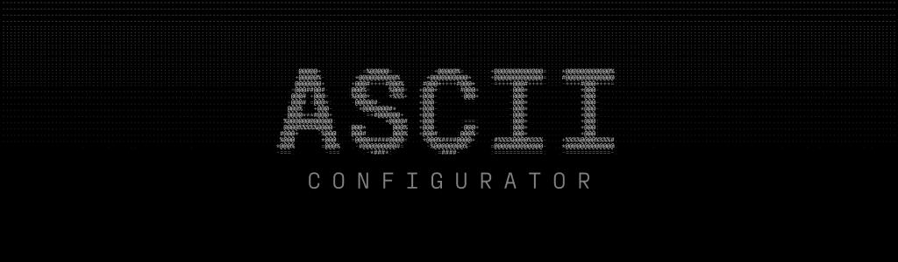
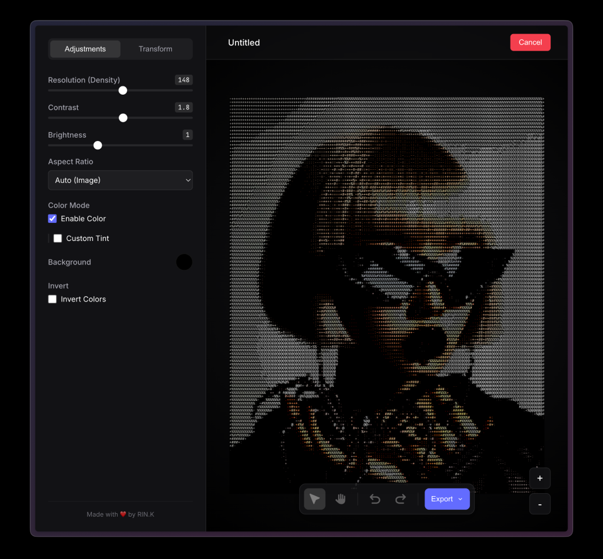

# ASCII Art Configurator

A modern, interactive web application that transforms images into customizable ASCII art. Built with vanilla JavaScript and Vite, featuring a responsive design, real-time adjustments, and a beautiful interactive backdrop.



## Features

- **Real-time Conversion**: Instantly convert uploaded images to ASCII art.
- **Customizable Output**:
  - **Resolution**: Adjust the density of the ASCII characters.
  - **Colors**: Customize background, text, highlight, and shadow colors.
  - **Transform**: Scale, rotate, and pan the output.
- **Export Options**: Save your creations as PNG or JPEG images.
- **Privacy Focused**: All processing happens locally in your browser. No images are uploaded to any server.



### Installation

1.  Clone the repository:
    ```bash
    git clone https://github.com/yourusername/ascii-art-configurator.git
    cd ascii-art-configurator
    ```

2.  Install dependencies:
    ```bash
    npm install
    ```

3.  Start the development server:
    ```bash
    npm run dev
    ```

4.  Open your browser and navigate to `http://localhost:5173` (or the port shown in your terminal).


## Contributing

Contributions are welcome! Please feel free to submit a Pull Request.

## License

This project is open source and available under the [MIT License](LICENSE).

---

Made with ❤️ by RIN.K
